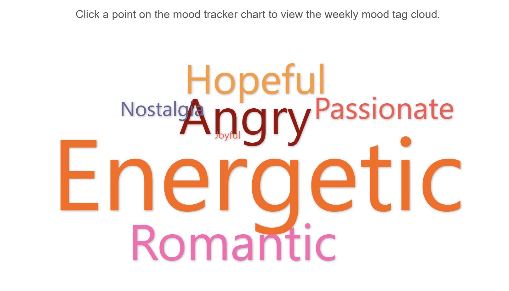

# **Table of Contents**
- [Project Description](#project-description)
- [Repository Structure](#repository-structure)
- [Instructions](#instructions)
  - [System Requirements](#system-requirements)
  - [Project Setup](#project-setup)
    - [1. Clone the Repository](#1-clone-the-repository)
    - [2. Create and Activate a Python Virtual Environment](#2-create-and-activate-a-python-virtual-environment)
    - [3. Install `llama-cpp-python`](#3-install-llama-cpp-python)
    - [4. Install Dependencies](#4-install-dependencies)
    - [5. Run the Web App](#4-run-the-web-app)
  - [Judging and Testing Steps](#judging-and-testing-steps)
    - [1. Register a user account](#1-register-a-user-account)
    - [2. Login](#2-login)
    - [3. Upload sample data](#3-upload-sample-data)
    - [4. View and process history](#4-view-and-process-history)
    - [5. Analyze your mood with AI](#5-analyze-your-mood-with-ai)
    - [6. Mood Tracker](#6-mood-tracker)
      - [Weekly Mood Trend Chart](#weekly-mood-trend-chart)
      - [Weekly Mood Tag Cloud](#weekly-mood-tag-cloud)
    - [7. Your playlist statistics](#7-your-playlist-statistics)
      - [Top 3 repeats each week](#top-3-repeats-each-week)
      - [Distribution of Music Completion Rate](#distribution-of-music-completion-rate)
      - [Distribution of Play Durations](#distribution-of-play-durations)
  - [Data Analysis Methodology](#data-analysis-methodology)
    - [Input Dataset We Accept](#input-dataset-we-accept)
    - [Data Cleaning](#data-cleaning)
    - [Listening Behavior Analysis](#listening-behavior-analysis)
    - [Mood Analysis with AI](#mood-analysis-with-ai)
      - [Significant Songs](#significant-songs)
      - [Asking the AI](#asking-the-ai)
      - [Weekly Mood Score](#weekly-mood-score)
      - [Weekly Mood Tags](#weekly-mood-tags)
  - [Models Downloaded \& Methods Used](#models-downloaded--methods-used)
    - [Sample Prompt for Mood Tag Inference](#sample-prompt-for-mood-tag-inference)
    - [Positivity Score Mapping](#positivity-score-mapping)
    - [Benchmarking](#benchmarking)
- [What's next for GinkgoGreen](#-whats-next-for-ginkgogreen)
- [Accomplishments that we're proud of](#-accomplishments-that-were-proud-of)
- [What we learned](#-what-we-learned)

# Project Description
## 🎵 Music Mood Mirror – An LLM-powered Emotional Wellness Companion by *GinkgoGreenAI*

## 🧠 Inspiration  
Music often reflects our emotional state—sometimes more honestly than we can express ourselves. While many people intuitively recognize this connection, those navigating mental health challenges like depression, anxiety, or bipolar disorder may struggle with emotional awareness.  

**Music Mood Mirror** was born from the idea that our listening habits—especially lyrics and genres—can act as passive signals for emotional trends. By tapping into the music people already love, we aim to offer meaningful emotional insights without the burden of manual tracking or journaling.

### 🏥 Healthcare Relevance  
**Music Mood Mirror** is directly aligned with the healthcare theme of this hackathon, focusing on **mental wellness and emotional self-awareness**.  

- For individuals with conditions like **depression**, **anxiety**, or **bipolar disorder**, emotional self-tracking can be inconsistent or burdensome.  
- Our tool provides a **non-intrusive, passive method** for emotional monitoring, supplementing traditional mood journaling.  
- Insights from the app could potentially be shared with **therapists, psychiatrists, or wellness platforms** to offer early signals of emotional changes or relapses.  
- The use of LLMs for **emotional signal extraction from natural media (music)** adds a novel angle to digital mental health support.

## ⚙️ What It Does  
**Music Mood Mirror** is a web app that passively analyzes users’ music listening history to track emotional trends over time. It leverages Large Language Models (LLMs) to extract sentiment, positivity scores, and recurring emotional themes from song lyrics.


### ✅ Key Features

- **Input**:  
  - User-uploaded listening history (song titles, artists, timestamps)  

- **LLM-Powered Analysis**:  
  - Sentiment and thematic analysis of lyrics  
  - Emotion tagging and positivity scoring  

- **Output**:  
  - Weekly stats: play duration, reason, completion %, repeat count  
  - Mood tags and scores (when user enables “Analyze Mood with AI”)  
  - Visualizations of emotional themes by week  
### 💡 Who It’s For  
Although designed with mental health support in mind, **Music Mood Mirror** is equally valuable for anyone curious about how their music reflects their mood—turning everyday playlists into a mirror for emotional self-awareness.
Let me know if you’d like a visual diagram or flowchart to include in your submission, or if you need a shorter version for slide decks!

## Repository Structure

```
music-mood-mirror/
├── web_app/                          # Main Flask web application source code
│   ├── static/                       # Static files (CSS, JS, images)
│   ├── templates/                    # HTML templates for the web UI
│   ├── app.py                        # Entry point for the web server
│   ├── install_llama_cpp.sh          # Script to install llama-cpp-python and dependencies
│   ├── requirements.txt              # Python dependencies for the project
│   └── ...                           # Other backend modules and utilities
├── notebooks/                        # Sample datasets and processed data
│   ├── run_first.sh                  # Installs all required Python libraries and dependencies
│   ├── main_Music-mood Mirror.ipynb  # Main notebook for end-to-end lyric analysis
│   ├── ground_truth.py               # Script to generate or collect ground truth data
│   ├── verify_results.ipynb          # Compares analysis results from local LLMs with grount truth
│   ├── RegisterLLM2MLflow.ipynb      # Registers Gemma-2B model with MLflow in AIStudio
│   └── ...   
├── data/                             # Sample datasets and processed data
│   ├── sample/                       # Example listening history files for testing
│   └── stats/                        # Analysis results and statistics (Excel, CSV)
├── figures/                          # Screenshots and images for documentation
├── analysis/                         # CSV files and result charts from model benchmarking
├── FEEDBACKS.md                      # Detailed feedback on AI Studio
└── README.md                         # Project documentation (this file)
```


# Instructions
## System Requirements

We strongly recommend setting up and running the web app of this project
in WSL2. We tested this project on Ubuntu 22.04; other distributions may also
work but we haven't tested them.

## Project Setup

### 1. Clone the Repository

Clone the music-mood-mirror Github repo and navigate to
the `music-mood-mirror/web_app` folder

```bash
git clone https://github.com/excelle08/music-mood-mirror.git
cd music-mood-mirror/web_app
```

### 2. Create and Activate a Python Virtual Environment

We recommend using Python's virtual environment (`venv`):

```bash
python3 -m venv venv
source venv/bin/activate        # On Windows: venv\Scripts\activate
```

### 3. Install `llama-cpp-python`

This project uses `llama-cpp-python` to execute the Gemma-2B model
for lyrics emotion inference, so we need to first build and install
this package by running the script:

```bash
bash install_llama_cpp.sh
```

### 4. Install Dependencies

Next, let's install the Python packages required to run the web app:

```bash
pip install -r requirements.txt
```

### 4. Run the Web App

```bash
python app.py
```

This command will first load the Gemma-2B LLM model, test it by asking it
"What is MLflow" and then start the web server. During the first run it will
also download the model into your `~/models` folder, which could take a few
more minutes depending on the internet connectivity.  If the LLM model did
not load successfully, the web app will still start but the features that 
require AI inference will not be available.

If you see the following output in your terminal, your web app is started and ready to use:

```
Model file gemma-2b-it.Q4_K_M.gguf is ready at /home/<username>/models/gemma-2b-it.Q4_K_M.gguf.
Testing the model with prompt: What is MLflow?
Model output: MLflow is an open-source platform for managing the entire machine learning lifecycle, from data preparation to model deployment. It provides a centralized repository ......
......
**Benefits of using MLflow:**

* **Improved Model Reproducibility:** MLflow makes it easier to reproduce the model's results, reducing the risk
Starting the web app...
 * Debugger is active!
 * Debugger PIN: 866-921-639
```

Then open [http://127.0.0.1:8081](http://127.0.0.1:8081) in your browser, you
will see a welcome page which gives a brief introduction to this project and
provides access points to the core features via the sidebar:


## Judging and Testing Steps

### 1. Register a user account

Click on "Register" at the bottom of the left sidebar to register a user account


### 2. Login

After registering the account, you will be directed to the login page to sign in


### 3. Upload sample data

After logging in successfully, the web app will automatically direct you to upload data for analysis.


At this step, you can upload the sample data we provided in the `data/sample` 
folder. We provide two datasets:
* [`processed_with_weeklyfreq/2017.json`](data/sample/processed_with_weeklyfreq/2017.json): A full year of music listening history by someone in 2017, with lyrics filled and behavioral metrics (e.g. weekly repeat frequency) pre-processed. This dataset allows for quick import and view.
* [`raw_spotify/2018_week_1_and_2.json`](data/sample/raw_spotify/2018_week_1_and_2.json): Two weeks of music listening history directly exported from Spotify, which means it does not contain lyrics or behavioral data and requires lyrics filling and analysis by this web app.

We recommend you upload the first dataset and then the next one. Of course,
you can try your own Spotify listening history, but be aware that it could
take longer time to search for lyrics on the internet.

After you choose the dataset and click "Upload", you will be able to see the
upload and import progress. Uploading pre-processed data is faster than
uploading raw Spotify history data, because the latter needs searching for
lyrics.


When upload finishes, you can click on the "View My History" button to go to
your uploaded playlist or click on anywhere outside the modal window to close
it and upload another dataset.

### 4. View and process history

After uploading the history dataset, you can view and process the history
data in the "My Playlist" page:


It will show a table of your listening history that you just uploaded.
For songs with lyrics populated, you can click on the "View" button to
see their lyrics.

Now, it's time to click on "Analyze History" to analyze the weekly behavior
metrics. After it finishes the last four columns of the table will populate.

### 5. Analyze your mood with AI

Click on "Analyze Mood with AI" button, the web server will start picking
significant songs in your playlist and analyze your mood during that time
with the help of AI. This will take some time, so please be patient. You can
monitor the progress in the progress bar modal window like this:


### 6. Mood Tracker

#### Weekly Mood Trend Chart


#### Weekly Mood Tag Cloud




### 7. Your playlist statistics

#### Top 3 repeats each week


#### Distribution of Music Completion Rate


#### Distribution of Play Durations


## Data Analysis Methodology

In this section we will discuss the dataset we use and analysis methodologies we applied.

### Input Dataset We Accept

We accept the standard Spotify listening history JSON files that you can export
from your Spotify account. The JSON file should contain a list of entries, with
each entry representing a music play and includes these fields that we care
about:

* `master_metadata_track_name` - The title of the song 
* `master_metadata_album_album_name` - Album name
* `master_metadata_album_artist_name` - Artist name
* `ms_played` - How long the song was played, in ms
* `reason_start` - Reason for the song started playing
* `reason_end` - Reason for the song ended
* `ts` - Date and time when the song was played, in ISO datetime format
* `shuffle` - Was the song played in random shuffle mode?
* `skipped` - Was the song skipped?

We also accept pre-processed JSON files which may have lyrics, behavioral data
and mood data pre-filled. You can take a look at the
[sample dataset](#3-upload-sample-data) we provide in this repo.

### Data Cleaning

To ensure satisfactory data quality and focus on songs that the user truely
wanted to listen and are more likely to genuinely reflect the listener's
emotion, we filtered out tracks with short durations or low completion rates.

Based on our analysis on distribution in
[music completion rate](data/stats/stats_music_completion_ratio.xlsx) and
[music play duration](data/stats/stats_played_duration.xlsx) among over 18,000
history entries, we decided to filter out songs that were played for less than
90 seconds or less than 50% of their full length. We also filtered out songs
that we could not find corresponding lyrics.

### Listening Behavior Analysis

In the [first step of data analysis](#4-view-and-process-history), we focus on
the repeat behavior in each week. We processed (1) how many times the song has
been repeated during the week (`repeats_this_week`) and (2) how many times the
song has been repeated in the rolling next 7 days (`repeats_next_7d`). In
further analysis, we decided to focus on `repeats_this_week`.

### Mood Analysis with AI

#### Significant Songs

Because inference with AI can be costly and time consuming, we only have the AI
read the top 10 significant songs that the user played in each caleandar week.
Our criteria for top significant songs are as follows:

1. Repeated for the highest number of times (sorting `repeats_this_week`)
2. The user actively chose to listen (selecting songs with `reason_start` of
   `clickrow`, `playbtn` or `backbtn`).

#### Asking the AI

We asked the AI to answer 3 emotional tags among a list of given tags that can
best summarize the emotions conveyed by the song's lyrics. Each tag is
previously assigned with a "positivity score" of 1 (most negative) to 5
(most positive) depending on the meaning, so the "positivity score" of the
song will be the average of the "positivity scores" of the three tags answered
by the AI.

The prompt we used and the positivity scores assigned to tags are described
in [Sample Prompt](#sample-prompt-for-mood-tag-inference) and
[Positivity Score Mapping](#positivity-score-mapping) of the next section.

#### Weekly Mood Score

The weekly mood score will be calculated by weighted average "positivity score"
among the scores of significant songs the user played in the week, with weights
being the number of `repeats_this_week`.

#### Weekly Mood Tags

Weekly mood tags are aggregation of tags associated with the weekly significant
songs. Tags are also weighted by `repeats_this_week` so they are displayed in
different sizes in the weekly mood cloud to reflect which tags are more significant.

## Models Downloaded & Methods Used

List all pre-trained or custom models used, with details on their sources, architectures, and the methods applied for training, fine-tuning, or inference.

We used the [Gemma-2B](https://ai.google.dev/gemma) model, running locally via the `llama-cpp-python` framework, as our LLM inference engine to analyze mood tags for each selected song. For each song, the model predicts three emotional tags from a predefined list. Each tag is mapped to a positivity score (1–5) using a dictionary, and the song's overall positivity score is the average of its tags' scores.

### Sample Prompt for Mood Tag Inference

Below is an example of the prompt used to instruct the LLM to infer mood tags from song lyrics:

```
    You are an expert in analyzing song lyrics to determine the emotions they convey.
    Analyze the following song lyrics and return exactly 3 emotion tags that best summarize the emotions conveyed by the song. Only output the tags, in this format: #tag1 #tag2 #tag3.
    The tags must be adjectives and strictly chosen from the following list: Joyful, Melancholic, Hopeful, Angry, Romantic, Nostalgic, Sad, Energetic, Passionate, Lonely, Uplifting, Bittersweet, Empowering, Heartbroken, Reflective, Playful, Dark, Calm, Longing, Triumphant
  '''{insert song lyrics here}'''
```
### Positivity Score Mapping 

The following dictionary maps each emotional tag to its corresponding positivity score (1–5):

```python
positivity_dict = {
  'Joyful': 5,
  'Melancholic': 2,
  'Hopeful': 5,
  'Angry': 1,
  'Romantic': 4,
  'Nostalgic': 3,
  'Sad': 1,
  'Energetic': 4,
  'Passionate': 4,
  'Lonely': 1,
  'Uplifting': 5,
  'Bittersweet': 3,
  'Empowering': 5,
  'Heartbroken': 1,
  'Reflective': 3,
  'Playful': 4,
  'Dark': 1,
  'Calm': 4,
  'Longing': 2,
  'Triumphant': 5
}
```

To optimize efficiency, we only analyze the top 10 most frequently played unique songs per week, as determined by repeat count. The weekly mood score is then calculated as a weighted average of these songs' positivity scores, weighted by their repeat counts.

### Benchmarking
For benchmarking, we also used the o3-mini model via OpenAI's API to analyze 20 randomly sampled songs, serving as a ground truth for comparison with our local LLM. The chart below illustrates the comparison of positivity scores between Gemma-2B and o3-mini:


# 🚀 What's next for GinkgoGreen

- **Enhancing Personalization**  
  We plan to introduce mood trend summaries and intelligent suggestions such as:  
  > *“You've been listening to more melancholic ballads this week, which may suggest a lower mood. Want to try a calming playlist or talk to someone?”*  
  This will help users reflect on their emotional patterns and take proactive steps when needed.

- **Improving Model Accuracy and Efficiency**  
  We'll continue refining our LLM pipeline through techniques like fine-tuning, smarter data sampling, and domain-specific adjustments to improve the quality and responsiveness of *Music Mood Mirror*.

- **Growing as a Team**  
  Looking ahead, we’re excited to deepen both our product thinking and technical capabilities. Our goal is to keep building meaningful, AI-powered tools that positively impact people’s lives—starting with music and mental wellness.


# 🏆 Accomplishments that we're proud of
One of the most meaningful accomplishments for us goes beyond the code itself. This project marks a full-circle moment in our friendship — we first teamed up for a college entrepreneur competition nearly 10 years ago but weren’t able to complete it due to coursework demands. Now, a decade later, we’ve grown into a data scientist/ML engineer and a software engineer, finally bringing a shared idea to life with *Music Mood Mirror*.

We're proud of building an end-to-end prototype within a short timeframe, combining LLM-based emotional analysis, a functional backend pipeline, and a responsive web dashboard. This wasn’t just a technical win — it was a personal one, too.

# 📚 What we learned
Through this hackathon, we learned how powerful it can be to blend friendship, creativity, and technical skill into something with the potential to make a real impact. We deepened our experience with LLMs, learned how to process and visualize emotional data from lyrics, and sharpened our ability to iterate quickly across the full stack — from ideation to deployment.

Most importantly, we were reminded that collaboration grounded in mutual respect and shared history can be a unique superpower. This project reinforced our belief in using technology with empathy — and we’re excited to keep building.
