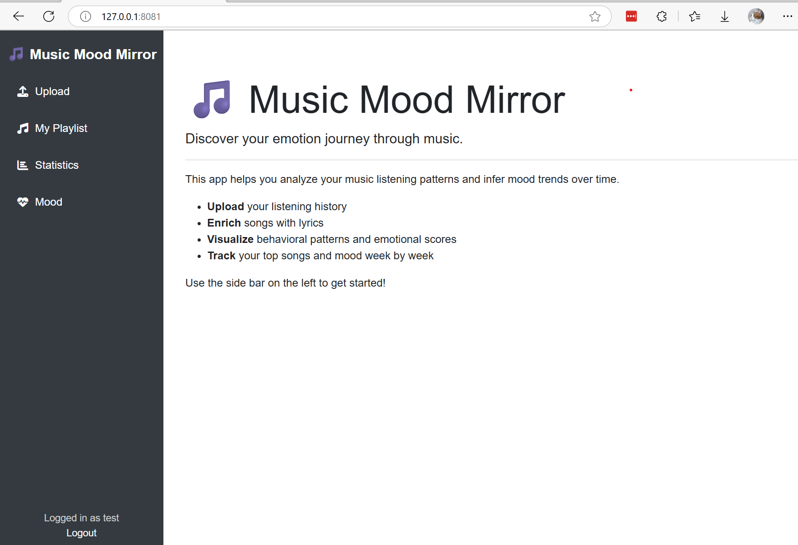

# Table of Contents

- [Table of Contents](#table-of-contents)
- [Project Description](#project-description)
  - [Technical Workflow with HP AI Studio](#technical-workflow-with-hp-ai-studio)
  - [Challenges Addressed \& Solutions Developed](#challenges-addressed--solutions-developed)
  - [Key Features of HP AI Studio Leveraged](#key-features-of-hp-ai-studio-leveraged)
  - [Lessons Learned \& Best Practices](#lessons-learned--best-practices)
- [Instructions](#instructions)
  - [System Requirements](#system-requirements)
  - [Project Setup](#project-setup)
    - [1. Clone the Repository](#1-clone-the-repository)
    - [2. Create and Activate a Python Virtual Environment](#2-create-and-activate-a-python-virtual-environment)
    - [3. Install `llama-cpp-python`](#3-install-llama-cpp-python)
    - [4. Install Dependencies](#4-install-dependencies)
    - [4. Run the Web App](#4-run-the-web-app)
  - [Judging and Testing Steps](#judging-and-testing-steps)
    - [1. Register a user account](#1-register-a-user-account)
    - [2. Login](#2-login)
    - [3. Upload sample data](#3-upload-sample-data)
    - [4. View and process history](#4-view-and-process-history)
    - [5. Analyze your mood with AI](#5-analyze-your-mood-with-ai)
    - [6. Mood Tracker](#6-mood-tracker)
      - [Weekly Mood Trend Chart](#weekly-mood-trend-chart)
      - [Weekly Mood Tag Cloud](#weekly-mood-tag-cloud)
    - [7. Your playlist statistics](#7-your-playlist-statistics)
      - [Top 3 repeats each week](#top-3-repeats-each-week)
      - [Distribution of Music Completion Rate](#distribution-of-music-completion-rate)
      - [Distribution of Play Durations](#distribution-of-play-durations)
  - [Data Analysis Methodology](#data-analysis-methodology)
    - [Input Dataset We Accept](#input-dataset-we-accept)
    - [Data Cleaning](#data-cleaning)
    - [Listening Behavior Analysis](#listening-behavior-analysis)
    - [Mood Analysis with AI](#mood-analysis-with-ai)
      - [Significant Songs](#significant-songs)
      - [Asking the AI](#asking-the-ai)
      - [Weekly Mood Score](#weekly-mood-score)
      - [Weekly Mood Tags](#weekly-mood-tags)
  - [Models Downloaded \& Methods Used](#models-downloaded--methods-used)

---

# Project Description

## Technical Workflow with HP AI Studio
Describe the end-to-end workflow implemented using HP AI Studio, including data ingestion, preprocessing, model training, evaluation, and deployment. Highlight how HP AI Studio's interface and automation streamlined these steps.

## Challenges Addressed & Solutions Developed
Outline the main technical and domain-specific challenges encountered during the project. Explain the solutions developed, such as data augmentation, model selection, or custom pipeline creation.

## Key Features of HP AI Studio Leveraged
Highlight the specific features of HP AI Studio that were instrumental, such as AutoML, collaborative notebooks, experiment tracking, or integrated model deployment.

## Lessons Learned & Best Practices
Summarize key takeaways from the project, including workflow optimizations, effective use of HP AI Studio features, and recommended practices for similar projects.

# Instructions

## System Requirements

We strongly recommend setting up and running the web app of this project
in WSL2. We tested this project on Ubuntu 22.04; other distributions may also
work but we haven't tested them.

## Project Setup

### 1. Clone the Repository

Clone the music-mood-mirror Github repo and navigate to
the `music-mood-mirror/web_app` folder

```bash
git clone https://github.com/excelle08/music-mood-mirror.git
cd music-mood-mirror/web_app
```

### 2. Create and Activate a Python Virtual Environment

We recommend using Python's virtual environment (`venv`):

```bash
python3 -m venv venv
source venv/bin/activate        # On Windows: venv\Scripts\activate
```

### 3. Install `llama-cpp-python`

This project uses `llama-cpp-python` to execute the Gemma-2B model
for lyrics emotion inference, so we need to first build and install
this package by running the script:

```bash
bash install_llama_cpp.sh
```

### 4. Install Dependencies

Next, let's install the Python packages required to run the web app:

```bash
pip install -r requirements.txt
```

### 4. Run the Web App

```bash
python app.py
```

This command will first load the Gemma-2B LLM model, test it by asking it
"What is MLflow" and then start the web server. During the first run it will
also download the model into your `~/models` folder, which could take a few
more minutes depending on the internet connectivity.  If the LLM model did
not load successfully, the web app will still start but the features that 
require AI inference will not be available.

If you see the following output in your terminal, your web app is started and ready to use:

```
Model file gemma-2b-it.Q4_K_M.gguf is ready at /home/<username>/models/gemma-2b-it.Q4_K_M.gguf.
Testing the model with prompt: What is MLflow?
Model output: MLflow is an open-source platform for managing the entire machine learning lifecycle, from data preparation to model deployment. It provides a centralized repository ......
......
**Benefits of using MLflow:**

* **Improved Model Reproducibility:** MLflow makes it easier to reproduce the model's results, reducing the risk
Starting the web app...
 * Debugger is active!
 * Debugger PIN: 866-921-639
```

Then open [http://127.0.0.1:8081](http://127.0.0.1:8081) in your browser, you
will see a welcome page which gives a brief introduction to this project and
provides access points to the core features via the sidebar:



## Judging and Testing Steps

### 1. Register a user account

Click on "Register" at the bottom of the left sidebar to register a user account


### 2. Login

After registering the account, you will be directed to the login page to sign in


### 3. Upload sample data

After logging in successfully, the web app will automatically direct you to upload data for analysis.


At this step, you can upload the sample data we provided in the `data/sample` 
folder. We provide two datasets:
* [`processed_with_weeklyfreq/2017.json`](data/sample/processed_with_weeklyfreq/2017.json): A full year of music listening history by someone in 2017, with lyrics filled and behavioral metrics (e.g. weekly repeat frequency) pre-processed. This dataset allows for quick import and view.
* [`raw_spotify/2018_week_1_and_2.json`](data/sample/raw_spotify/2018_week_1_and_2.json): Two weeks of music listening history directly exported from Spotify, which means it does not contain lyrics or behavioral data and requires lyrics filling and analysis by this web app.

We recommend you upload the first dataset and then the next one. Of course,
you can try your own Spotify listening history, but be aware that it could
take longer time to search for lyrics on the internet.

After you choose the dataset and click "Upload", you will be able to see the
upload and import progress. Uploading pre-processed data is faster than
uploading raw Spotify history data, because the latter needs searching for
lyrics.


When upload finishes, you can click on the "View My History" button to go to
your uploaded playlist or click on anywhere outside the modal window to close
it and upload another dataset.

### 4. View and process history

After uploading the history dataset, you can view and process the history
data in the "My Playlist" page:


It will show a table of your listening history that you just uploaded.
For songs with lyrics populated, you can click on the "View" button to
see their lyrics.

Now, it's time to click on "Analyze History" to analyze the weekly behavior
metrics. After it finishes the last four columns of the table will populate.

### 5. Analyze your mood with AI

Click on "Analyze Mood with AI" button, the web server will start picking
significant songs in your playlist and analyze your mood during that time
with the help of AI. This will take some time, so please be patient. You can
monitor the progress in the progress bar modal window like this:


### 6. Mood Tracker

#### Weekly Mood Trend Chart


#### Weekly Mood Tag Cloud


### 7. Your playlist statistics

#### Top 3 repeats each week


#### Distribution of Music Completion Rate


#### Distribution of Play Durations


## Data Analysis Methodology

In this section we will discuss the dataset we use and analysis methodologies we applied.

### Input Dataset We Accept

We accept the standard Spotify listening history JSON files that you can export
from your Spotify account. The JSON file should contain a list of entries, with
each entry representing a music play and includes these fields that we care
about:

* `master_metadata_track_name` - The title of the song 
* `master_metadata_album_album_name` - Album name
* `master_metadata_album_artist_name` - Artist name
* `ms_played` - How long the song was played, in ms
* `reason_start` - Reason for the song started playing
* `reason_end` - Reason for the song ended
* `ts` - Date and time when the song was played, in ISO datetime format
* `shuffle` - Was the song played in random shuffle mode?
* `skipped` - Was the song skipped?

We also accept pre-processed JSON files which may have lyrics, behavioral data
and mood data pre-filled. You can take a look at the
[sample dataset](#3-upload-sample-data) we provide in this repo.

### Data Cleaning

To ensure satisfactory data quality and focus on songs that the user truely
wanted to listen and are more likely to genuinely reflect the listener's
emotion, we filtered out tracks with short durations or low completion rates.

Based on our analysis on distribution in
[music completion rate](data/stats/stats_music_completion_ratio.xlsx) and
[music play duration](data/stats/stats_played_duration.xlsx) among over 18,000
history entries, we decided to filter out songs that were played for less than
90 seconds or less than 50% of their full length. We also filtered out songs
that we could not find corresponding lyrics.

### Listening Behavior Analysis

In the [first step of data analysis](#4-view-and-process-history), we focus on
the repeat behavior in each week. We processed (1) how many times the song has
been repeated during the week (`repeats_this_week`) and (2) how many times the
song has been repeated in the rolling next 7 days (`repeats_next_7d`). In
further analysis, we decided to focus on `repeats_this_week`.

### Mood Analysis with AI

#### Significant Songs

Because inference with AI can be costly and time consuming, we only have the AI
read the top 10 significant songs that the user played in each caleandar week.
Our criteria for top significant songs are as follows:

1. Repeated for the highest number of times (sorting `repeats_this_week`)
2. The user actively chose to listen (selecting songs with `reason_start` of
   `clickrow`, `playbtn` or `backbtn`).

#### Asking the AI

We asked the AI to answer 3 emotional tags among a list of given tags that can
best summarize the emotions conveyed by the song's lyrics. Each tag is
previously assigned with a "positivity score" of 1 (most negative) to 5
(most positive) depending on the meaning, so the "positivity score" of the
song will be the average of the "positivity scores" of the three tags answered
by the AI.

#### Weekly Mood Score

The weekly mood score will be calculated by weighted average "positivity score"
among the scores of significant songs the user played in the week, with weights
being the number of `repeats_this_week`.

#### Weekly Mood Tags

Weekly mood tags are aggregation of tags associated with the weekly significant
songs. Tags are also weighted by `repeats_this_week` so they are displayed in
different sizes in the weekly mood cloud to reflect which tags are more significant.

## Models Downloaded & Methods Used
List all pre-trained or custom models used, with details on their sources, architectures, and the methods applied for training, fine-tuning, or inference.
