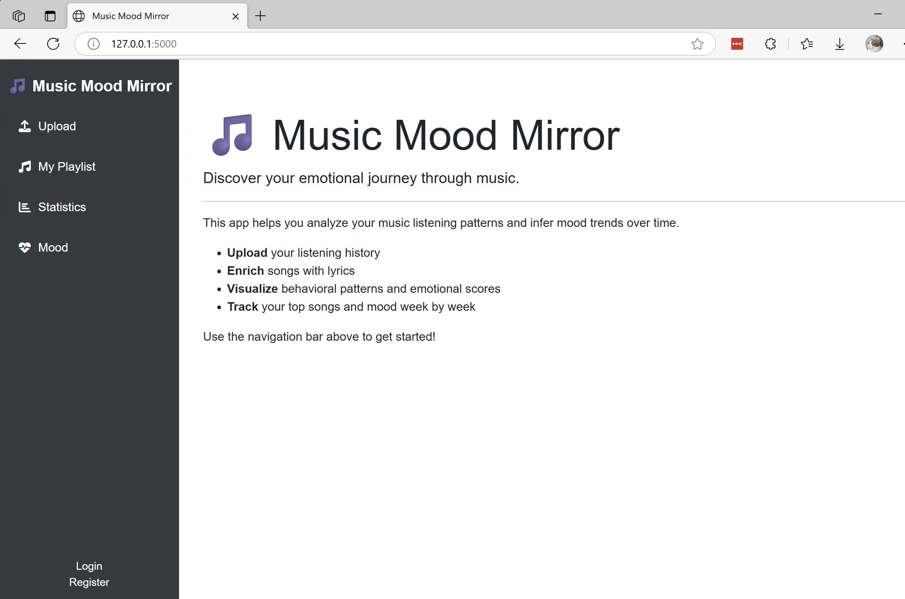

# Table of Contents

- [Table of Contents](#table-of-contents)
- [Project Description](#project-description)
  - [Technical Workflow with HP AI Studio](#technical-workflow-with-hp-ai-studio)
  - [Challenges Addressed \& Solutions Developed](#challenges-addressed--solutions-developed)
  - [Key Features of HP AI Studio Leveraged](#key-features-of-hp-ai-studio-leveraged)
  - [Lessons Learned \& Best Practices](#lessons-learned--best-practices)
- [Instructions](#instructions)
  - [System Requirements](#system-requirements)
  - [Project Setup](#project-setup)
    - [1. Clone the Repository](#1-clone-the-repository)
    - [2. Create and Activate a Python Environment](#2-create-and-activate-a-python-environment)
    - [3. Install Dependencies](#3-install-dependencies)
    - [4. Run the Web App](#4-run-the-web-app)
  - [Judging and Testing Steps](#judging-and-testing-steps)
  - [Input Dataset \& Preprocessing](#input-dataset--preprocessing)
  - [Models Downloaded \& Methods Used](#models-downloaded--methods-used)
  - [Dependencies \& Requirements](#dependencies--requirements)

---

# Project Description

## Technical Workflow with HP AI Studio
Describe the end-to-end workflow implemented using HP AI Studio, including data ingestion, preprocessing, model training, evaluation, and deployment. Highlight how HP AI Studio's interface and automation streamlined these steps.

## Challenges Addressed & Solutions Developed
Outline the main technical and domain-specific challenges encountered during the project. Explain the solutions developed, such as data augmentation, model selection, or custom pipeline creation.

## Key Features of HP AI Studio Leveraged
Highlight the specific features of HP AI Studio that were instrumental, such as AutoML, collaborative notebooks, experiment tracking, or integrated model deployment.

## Lessons Learned & Best Practices
Summarize key takeaways from the project, including workflow optimizations, effective use of HP AI Studio features, and recommended practices for similar projects.

# Instructions

## System Requirements

We strongly recommend setting up and running the web app of this project
in WSL2.

## Project Setup

### 1. Clone the Repository

```bash
git clone https://github.com/excelle08/music-mood-mirror.git
cd music-mood-mirror
```

### 2. Create and Activate a Python Environment

We recommend using Python's virtual environment (`venv`):

```bash
python3 -m venv venv
source venv/bin/activate        # On Windows: venv\Scripts\activate
```

### 3. Install Dependencies

```bash
pip install -r requirements.txt
```

### 4. Run the Web App

```bash
flask run
```

Then open [http://127.0.0.1:5000](http://127.0.0.1:5000) in your browser, you
will see a welcome page which gives a brief introduction to this project and
provides access points to the core features via the sidebar:



## Judging and Testing Steps
Provide clear, step-by-step instructions for judges or testers to run the project, including environment setup, data access, and evaluation procedures.
- Clone the repository to your local machine.
- Install required dependencies as listed in the [Dependencies & Requirements](#dependencies--requirements) section.
- Obtain access to the dataset and follow the steps [HERE](#input-dataset--preprocessing) to preprocess data. (a dataset example is provided in the repository). 
- Set up environment variables or configuration files as needed.
- Run the main script or notebook to start the application.
- Follow prompts to upload or select music files for mood analysis.
- Review output results and logs for evaluation.
- For troubleshooting, consult the FAQ or open an issue in the repository.

## Input Dataset & Preprocessing
You may use data from your Spotify listing history and ... 
<!-- any pre-filtering you've done -->
Our sample input dataset consists of ten years (2016–2025) of Spotify music listening history, with each year treated as a distinct user profile. Each song entry includes fields such as "timestamp", "song title", "artist", "album", "duration", and more. 

```json
list of fields
```

To ensure data quality, we filtered out tracks with short durations or low completion rates, focusing on entries that likely reflect genuine listening intent—specifically those with play reasons like `clickrow`, `bwd_btn`, and `fwd_btn`. For further details on our preprocessing and analysis, see [ABC]. <!-- the pointer to excel files -->

The final dataset contains 123,456 entries.
<!-- write more here -->

## Models Downloaded & Methods Used
List all pre-trained or custom models used, with details on their sources, architectures, and the methods applied for training, fine-tuning, or inference.

## Dependencies & Requirements
Enumerate all software dependencies, libraries, and system requirements. Include installation commands or environment configuration details.